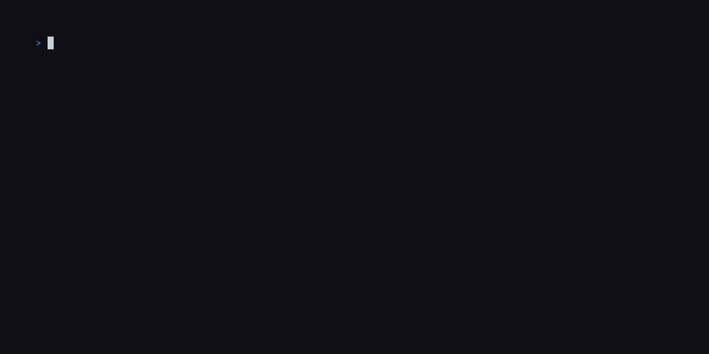

# wfcache-api

`wfcache-api` is a Rust application that allows you to read and extract data 
from Warframe's cache files programmatically.

## Dependencies

This binary depends on [Oodle](http://www.radgametools.com/oodle.htm) for
decompression. You will need to install the shared library, to do so follow the
instructions here: https://github.com/sehnryr/get-oodle-lib

## Shell ergonomics

- [ ] run commands from outside the shell (e.g. `wfcache-api -c "ls /Lotus" [arg ...]`)

## Supported formats

- [x] `*.png` Images (Exported as DDS)
- [x] `*.wav` Audio (Exported as either WAV or Opus)
- [ ] `*.fbx` 3D models
